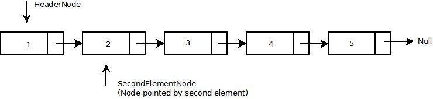

# Abstract Data types

___


<!-- @import "[TOC]" {cmd="toc" depthFrom=1 depthTo=6 orderedList=false} -->
<!-- code_chunk_output -->

* [Abstract Data types](#abstract-data-types)
	* [Basic Datatypes](#basic-datatypes)
	* [Abstract Datatypes](#abstract-datatypes)
	* [Examples of Datatypes](#examples-of-datatypes)
		* [Integers](#integers)
		* [Lists](#lists)
		* [LinkedLists](#linkedlists)
			* [Singly LinkedLists](#singly-linkedlists)
			* [Singly LinkedList in Python](#singly-linkedlist-in-python)
		* [Stack ADT](#stack-adt)
			* [Stack In Python](#stack-in-python)
		* [Queue ADT](#queue-adt)
			* [Queue in Python](#queue-in-python)

<!-- /code_chunk_output -->


## Basic Datatypes

* Integers
  * Boolean
  * Char
  * Short
* Double
* Float

## Abstract Datatypes

An abstract datatype is a mathematical model that consists of 1 or more fields, a set of operations to manipulate the fields. In abstract datatype, we only care about the definition of the ADT and not the underlying implementation.

## Examples of Datatypes

### Integers

Integers along with these functions $/$,$*$,$+$,$-$ consist a datatype. In order to use it, we need to know all of the available operations. We, however, don't need to know how an integer is represented by a language or a computer.

The same principle is applied to floats and doubles.

An ADT can be implement using other datatype, for example, a priority queue can be implemented using Lists, Trees, etc.

### Lists

A list is a sequence of elements.

* Every element in the list is called a Node.
* Using we denote the node in the list.
* Length of a list is the number of elements in it.

A list contains the following operations:

* Create a new list
* Add a new element
* Remove an element
* Find a specific element
* Sort on a condition

The most important operations in a list, are the insertion and removal of the first element as they take constant time = ${O(1)}$.

### LinkedLists

LinkedLists use dynamic memory allocation. This means that they use memory only when needed and don't reserve unnecessary memory.

#### Singly LinkedLists

In a SLL(Singly Linked List) a node contains a single pointer to the next element and is unaware of the previous elements.


#### Singly LinkedList in Python

```Python
class Node:

    def __init__(self, element=None, next_node=None):
        self.next_node = next_node
        self.element = element

    def __bool__(self):
        return self.element is not None

    def __eq__(self, other):
        return self.element == other

    # We return a pair object in order to have a referrence to the next node.
    def remove(self, element):

        if self == element:
            return self.next_node, True

        if self.next_node is None:
            return self, False

        result = self.next_node.remove(element)
        self.next_node = result[0]
        return self, result[1]

    class LinkedList:

        def __init__(self):
            self.root = Node()
            self.size = 0
            self.current = None
            return

        def insert(self, element):
            self.root = Node(element, self.root)
            self.size += 1
            return

        # The only edge check we have to do is the root element,
        # The other 2 cases (in the middle, in the end) can be abstracted and treated as one
        def remove(self, element):
            if self.size == 0:
                return False

            if self.root == element:
                self.root = self.root.next_node
                self.size -= 1
                return True

            current = self.root
            while current.next_node and current.next_node != element:
                current = current.next_node

            res = current.next_node == element
            self.size -= res
            current.next_node = current.next_node if not res else current.next_node.next_node

            return res

        # Creates an array with all the elements in O(n), Sorts them in O(nlogn)
        # Overwrites in O(n) time
        # Has O(nlogn) runtime.
        def sort(self, comp=None, key=None, reverse=False):
            elements = [x for x in self]
            current = self.root
            for element in sorted(elements, cmp=comp, key=key, reverse=reverse):
                current.element = element

            return self

        # Calls remove element from node object and it recursively removes an element
        # Remove function returns a pair object that contains the new next node
        # (the new root in this case) and a boolean, indicating removal or not of element.
        def remove_recursive(self, element):
            result = self.root.remove(element)
            self.root = result[0]

            if result[1]:
                self.size -= 1

            return result[1]

        # toString equivalent
        def __repr__(self):
            return str([x for x in self])

        # Simple iterator function, allows us to write for x in <list>,
        # Equivalent to forEach in Java
        def __iter__(self):
            current = self.root

            while current:
                yield current.element
                current = current.next_node

            return iter(self)

        # Size/Len of the list
        def __len__(self):
            return self.size
```

File along with tests is available [here](../../Code/Datastructures/List/Python/LinkedList.py).

A more complex LinkedList with operator overloading and other extra functionality is available [here](../../Code/Datastructures/List/Python/ExtendedLinkedList.py).

A list can also be implemented using arrays, called ArrayList. Depending on the implementation however, an ArrayList may have ${O(n)}$ insertion when the initial capacity of the array is reached and all elements will have to be migrated in a new array.

An easy workaround is using *lazy migration*. When the initial capacity is reached, instead of migrating all elements, we can migrate another element when a new operation is done to the list.

__Note__: In Python, the list type is implemented using arrays but has always $O(1)$ insertion and removal.


Two common list types are:

* Stacks
* Queues

### Stack ADT

A stack is a datatype such that the first element in is the last element out. Suppose a stack of books, in order to get to the bottom, we have to remove all the books from the top. In the same vein, to get to the first element we have added, we have to remove all the elements we added after it.


A stack has the following set of operations.

|Operation|Description|
|-|-|
|```makeEmpty()```| Create an empty stack|
|```isEmpty()```| Return ```True``` if the stack is empty otherwise, ```False```|
|```push(x)```| Add X to the top of the stack|
|```pop()```| Remove the element at the top of the stack and return it|
|```top()```| Peek the element at the top of the stack|
|```size()```| Return how many elements are in the stack|

Stack operations are bound by the following rules:

|Operation|Result|
|-|-|
|```isEmpty(makeEmpty)``` |  ```True``` |
|```isEmpty(push(x))``` |```False```|
|```pop(makeEmpty)```| Error|
|```pop(push(x))```|x|
|```top(makeEmpty())```| Error|
|```top(push(x))```|x|

#### Stack In Python

```Python
class stack:

    def __init__(self): #makeEmpty
        self.elements = []

    def __len__(self):
        return len(self.elements)

    # Boolean function, returns true if the stack is not empty.
    # Is to be used in place of isEmpty
    def __bool__(self):
        return bool(self.elements)

    # Allows us to do this: stack += x and x is put at the top of the stack
    def __iadd__(self, element):
        self.elements.append(element)
        return self

    # Pushes an element at the top of the stack, same as
    def push(self, element):
        self.elements.append(element)
        return self

    #Allows us to pop n times the stack using stack -= n
    def __isub__(self, other):
        for i in range(other):
            self.elements.pop()
        return self

    def __str__(self):
        return str(self.elements)

    #Removes the element at the top of the stack
    def pop(self):
        return self.elements.pop()

    # Not a default operation of a stack but allows us to 
    # pop the stack count times and keep the all the elements.
    # as it returns a generator object
    def chop(self, count=1):
        for _ in range(count):
            yield self.elements.pop()

    #Get the topmost element.
    def peek(self):
        return self.elements[-1]

    #Empties itself by creating a new list.
    def make_empty(self):
        self.elements = []
        return self

```

A simple stack implementation in Python using the built-in list datatype.

Code [here](../../Code/Datastructures/Stack/Python/Stack.py).

Stacks are often implemented using linked lists.

A stack can also be implemented using arrays, similar to list and the same constraints apply.

In essence, a stack is a list, where removal and insertion happens at the position of the last element.

### Queue ADT

As the name suggests, a queue is an Abstract DS such that the first element inserted is the first element that will be removed. Similar to a queue at the market counter, the first to arrive is also the first to leave. This is called FIFO, first in first out.

Just like stacks and lists, a queue is often implemented with linked lists but can also be implemented using arrays.


A queue has the following set of operations.

|Operation|Description|
|-|-|
|```makeEmpty()```| Create an empty queue|
|```isEmpty()``` | Return ```True``` if the queue is empty otherwise, ```False```|
|```enQueue(x)``` | Add X to the front of the queue|
|```deQueue``` | Remove the element at the front of the queue and return it.```|
|```top()```| Peek the element at the front of the queue.|
|```size()```| Return how many elements are in the queue.|

Queue operations are bound by the following rules:

|Operation|Result|
|-|-|
|```isEmpty(makeEmpty)``` |  ```True``` |
|```isEmpty(enQueue(x))``` |```False```|
|```deQueue(makeEmpty)```| Error|
|```deQueue(enQueue(x))```| ```y``` if queue has more than 1 element else ```x```|
|```top(makeEmpty())```| Error |
|```top(push(x))```| ```y``` if queue has more than 1 element else ```x```|


#### Queue in Python
```Python
class Queue:

    def __init__(self): #makeEmpty
        self.elements = []

    def __len__(self):
        return len(self.elements)
    
    #Boolean function, returns true if the Queue is not empty.
    #Is to be used in place of isEmpty
    def __bool__(self):
        return bool(self.elements)

    #Allows us to do this: Queue += 1 and 1 is put at the top of the Queue
    def __iadd__(self,other):
        self.elements.insert(other)
        return self

    #Allows us to pop n times the Queue using Queue -= n
    def __isub__(self, other):
        for i in range(other):
            self.elements.pop()
        return self
    
    def __str__(self):
        return str(self.elements)
    
    #Removes count elements from the Queue 
    #and returns them in a generator object
    def pop(self, count = 1):
        for element in range(count):
            yield self.elements.pop()
    #Get the topmost element.
    def peek(self):
        return self.elements[0]
    
    #Empties itself by creating a new list.
    def make_empty(self):
        self.elements = []
        return self

```

Code [here](../../Code/Datastructures/Queue/Python/Queue.py).
